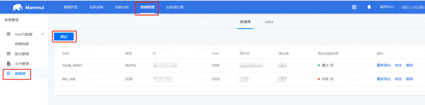
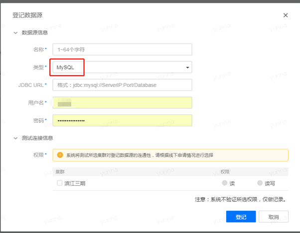
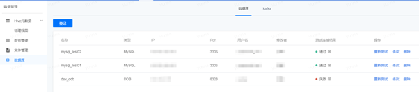

在您拥有了项目空间的基础上，下面将指引您快速完成一个完整的数据传输和运维操作。以MySQL数据源为例，说明如何利用数据管理功能将猛犸平台汇总的数据导出到MySQL数据源中，其他数据源的使用详解请参阅“用户手册”的“数据管理”部分。

## 新增数据源

* 进入顶部菜单栏中的“数据管理”页面，单击左侧导航栏中的“数据源”。

 

* 单击左上角的“登记”，类型选择“MySQL”,填写相关信息。

 

* 点击“测试连接”，测试数据源的连通性，若测试连通性成功，可进行下面的步骤，若测试连通性失败，请根据自身情况进行调整，检查数据源信息或网络状况等。

 

