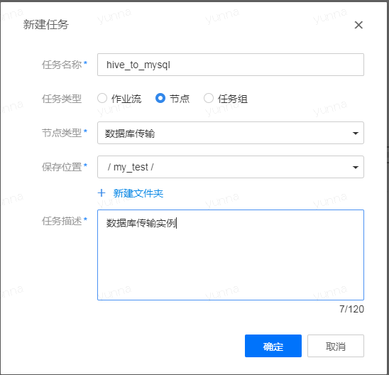
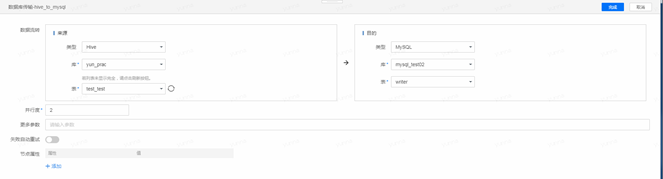
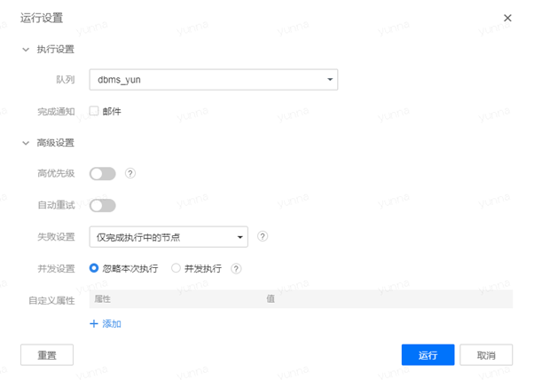
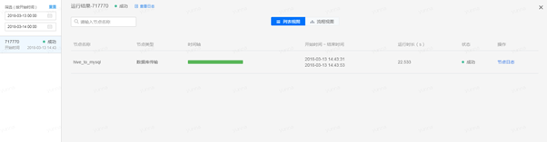

## 新建文件夹，新建数据库传输的节点任务

* 进入顶部菜单栏的“数据开发”界面，单击左上角的“+新建”操作，选择“新建文件夹”选项，可自定义文件夹名称，例如my_test，默认保存在根目录下。

 

* 同样单击左上角的“+新建”选项，创建一个数据库传输的节点任务，任务可自定义名称，例如hive_to_mysql，选择保存在my_test文件夹下。

 

* 节点任务创建成功之后，在“数据开发”的界面新增了“hive_to_mysql”的数据传输节点，右键选择“编辑”，对源数据和目标数据进行配置。

 

来源类型选择“Hive”,来源库以及表选择上面创建的yun_proc数据库下的test_test离线表；目的类型选择“MySQL”，目的库选择在“数据管理”的“数据源”中测试连接成功的MySQL数据库的名称，表选择MySQL中存在的表。

注：

在导出之前，要确保Hive中表的字段类型和MySQL中的表字段类型的一致性。

* 节点信息编辑完成之后，就可以选择该节点“设置并运行”，有关于“运行设置”如下图所示。

 

其中的“队列”指的是在申请项目空间时所命名的队列，用于设置作业流执行使用。有关于其他字段的详细说明请参阅“模块指南”中的“项目中心”章节。

* 点击“运行”之后，可以看到该节点任务的具体执行状况，同时对应有“节点日志”选项，可在任务失败的情况下查看报错信息，定位失败原因。

 

