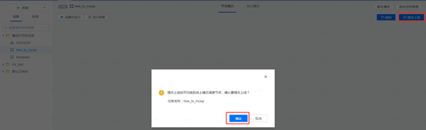
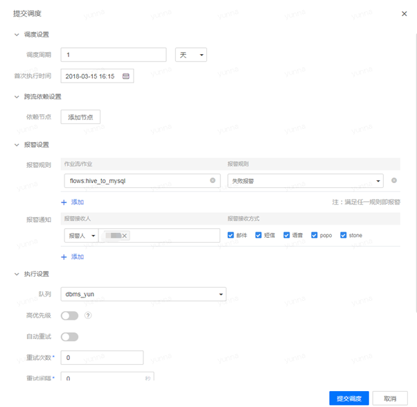
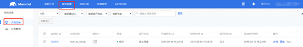
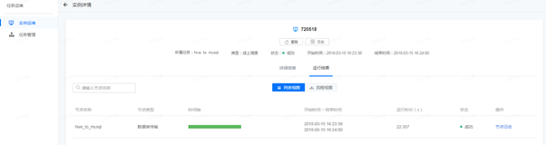
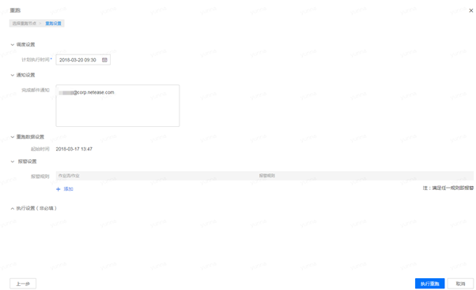
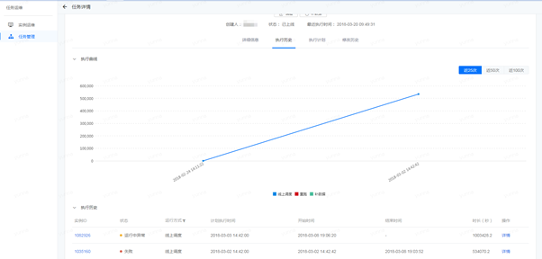
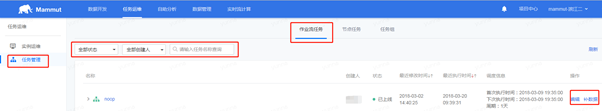
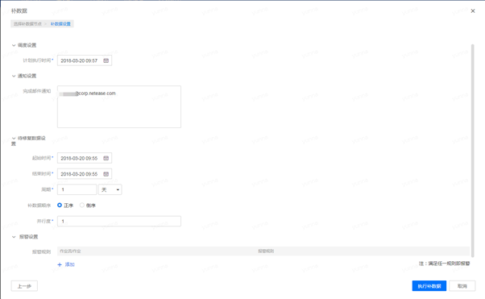
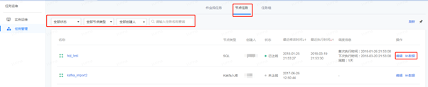
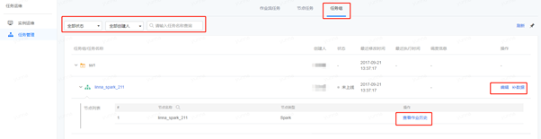

## 提交上线，任务运维

* 对已经测试成功的节点任务，可点击“提交上线”。

 

* 在界面上由“开发模式”切换到“线上模式”，可对提交上线的节点任务进行调度的编辑操作。选择“设置并提交调度”选项，对调度信息进行配置。

 

本平台支持天、小时、分钟、月以及星期的周期选项，有关于更详细的配置说明，请参阅“用户手册”中的“提交调度”章节。

注：

新版本的猛犸平台区分了测试环境(开发模式)和线上环境(线上模式)，两个环境中的代码隔离，但是数据没有隔离，故在开发模式下立即执行的时候，需要注意临时修改数据目录。

* 任务提交之后，可前往顶部菜单栏“任务运维”的“实例运维”中进行相关信息的查看。

 

* 针对调度任务，可以进行“重跑”和“详情”操作。点击“详情”选项，可以从列表和视图两种形式查看实例的具体运行信息。

 

* 若选择“重跑”操作，对重跑任务的条件进行设置后，该任务可重新执行。

 

* 在“任务运维”的“任务管理”选项中，用户可查看当前产品线任务列表，针对单个任务，点击该任务，可查看详细信息，包括执行历史，执行计划和修改历史。

 

* 在“作业流任务”Tab下，可按照任务状态，创建人和名称对任务进行定位删选，同时对已跑的任务进行编辑和补数据操作。

* “补数据”选项意味着可以对任务执行发生在过去一段时间的调度，需要配置待修复数据的相关信息。

* 在“节点任务”Tab下，除了点击任务，可查看详细信息之外，也能按照状态，节点类型，创建人和任务名称进行筛选定位，同时编辑和补数据。

* 在“任务组”Tab下，可按照状态，创建人和任务名称进行筛选定位，同时可查看任务组的结构，对作业流可编辑和补数据操作，对节点任务可查看作业历史。

