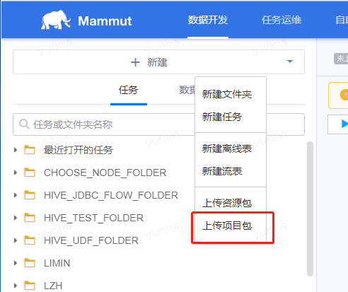
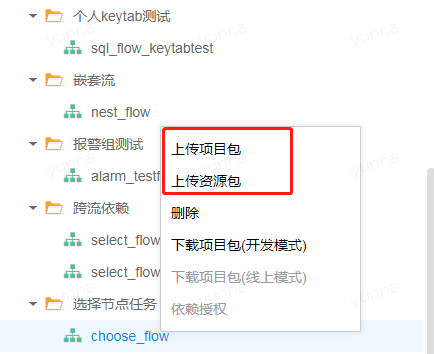
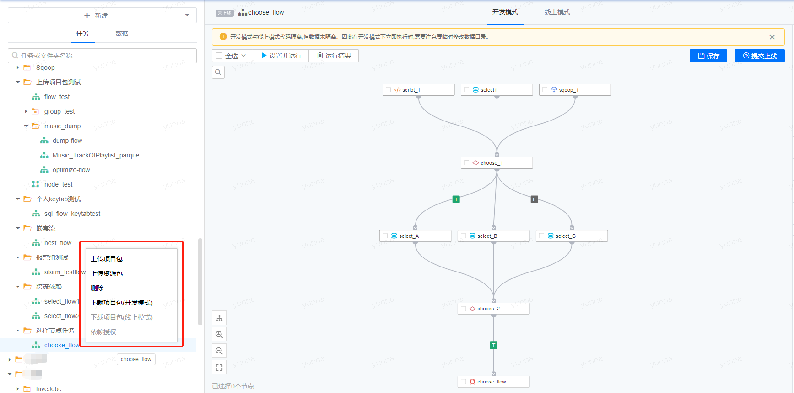

## 上传/下载项目包，上传资源包

在“数据开发”界面，可对任务进行“上传项目/资源包”和“下载项目包”操作。

* 点击“+新建”，会出现“上传项目包”选项。

 

* 选择本地的zip包，在上传项目包的时候，还可以新建任务用来保存该项目。

 

注：

上传的项目包的Zip文件中，必须包含后缀名为job的文件。

* 若选择的是“上传资源包”选项，同样需要选择本地的Zip资源包，同时指定任务。

 

注：

若选择的任务不是任务组任务，那么Zip包中不能包含后缀名为job的文件。

* 以上的“上传项目包”和“上传资源包”选项也可以在左侧任务列表中，针对特定的任务进行右键点击操作，步骤一致。

* 选择任务，右击会出现操作选项，选择“下载项目包”即可将平台项目包下载到本地。

注：

如果某个任务没有线上模式的项目包，那么该任务右键的操作选项中“下载项目包(线上模式)”会置灰，不可选择。