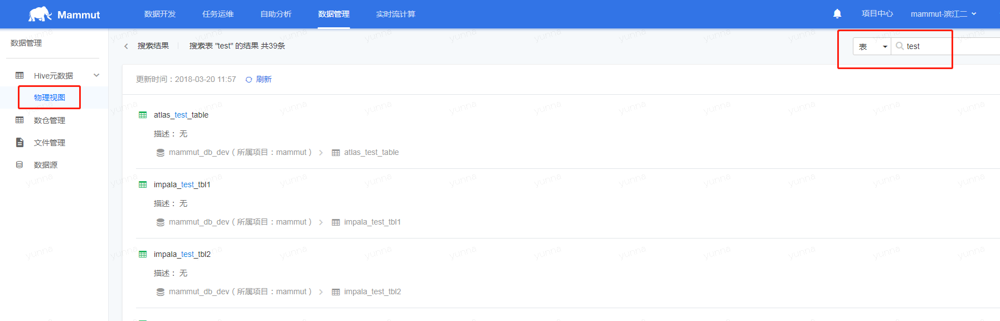
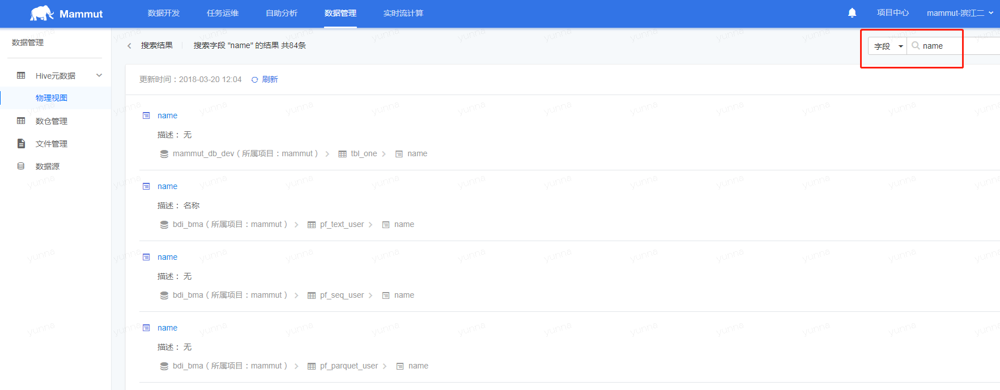
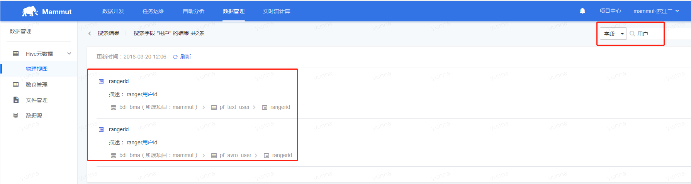
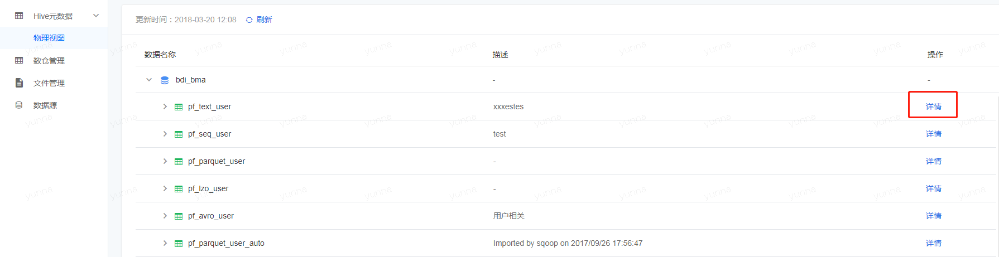
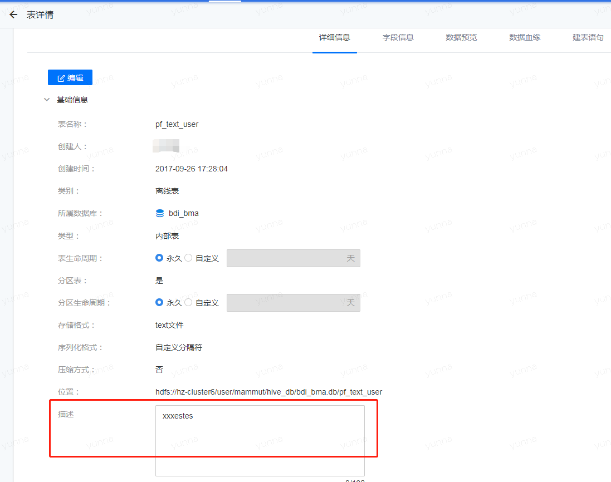
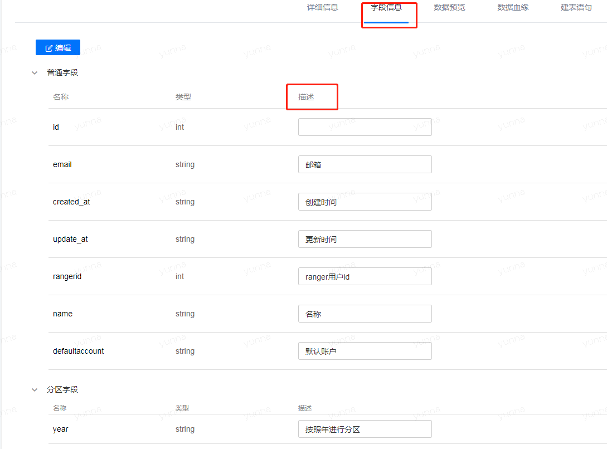

## 快速定位Hive表/字段

在“数据管理”的“Hive元数据”中，当创建的表数量众多，可通过右上角的搜索操作快速定位。
支持通过“表”和“字段”进行定位，同时筛选条件还支持模糊匹配表/字段名或者表/字段描述。

* 筛选条件是“表”和表名。如下所示，所有包含“test”表名的表都会被搜索到。

 

* 筛选条件是“表”和表描述。如下所示，所有表描述中包含“用户”的表会被搜索到。

 

* 筛选条件是“字段”和字段名。如下所示，所有包含“name”的字段会被搜索到。

 

* 筛选条件是“字段”和字段描述。如下所示，所有包含“名字”的字段描述的字段会被搜索到。

* 在表或者字段的详情中，我们可以对表和字段进行编辑，添加描述信息，便于表/字段的定位筛选。

* 表的“详细信息”中，添加对表的描述。

* “字段信息”中，添加对字段的描述信息。

若您完成“新手入门”的相关操作之后，已经学会了如何在该平台上将Hive离线表中的数据导入到MySQL数据源中，同时提交上线，设置调度周期，查看运维实例，取消调度和删除这一系列的操作，有关于更多的使用详情，请参阅“用户手册”。
