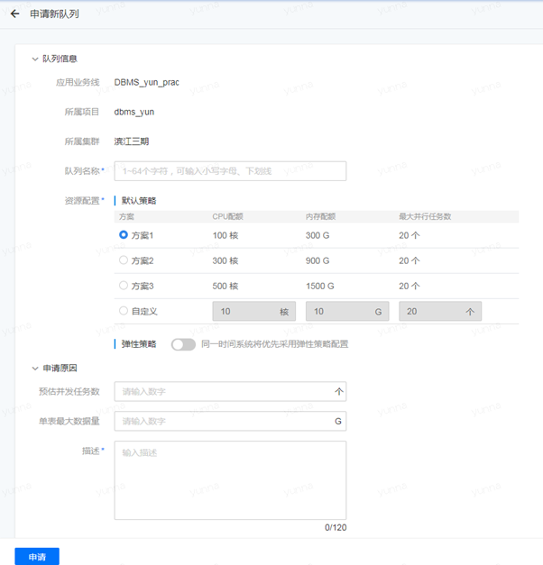
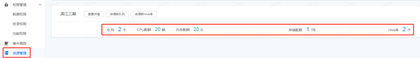

若您认为创建项目时分配的资源过于紧张，您可以继续阅读该小节，学习如何申请新资源。

## 申请新队列

* 选择“项目中心”下的左侧菜单栏中“资源管理”，可以在您当前的集群资源信息中看到有“申请新队列”选项。

 

* 填写您想要申请的新的队列信息。 

* 申请新的队列资源需要平台管理员的审批，在“用户中心”的“待审批”界面可以看到审批进度。

* 管理员审批之后，在“项目中心”的“资源管理”界面就可以看到，您集群中的队列资源发生了改变。

