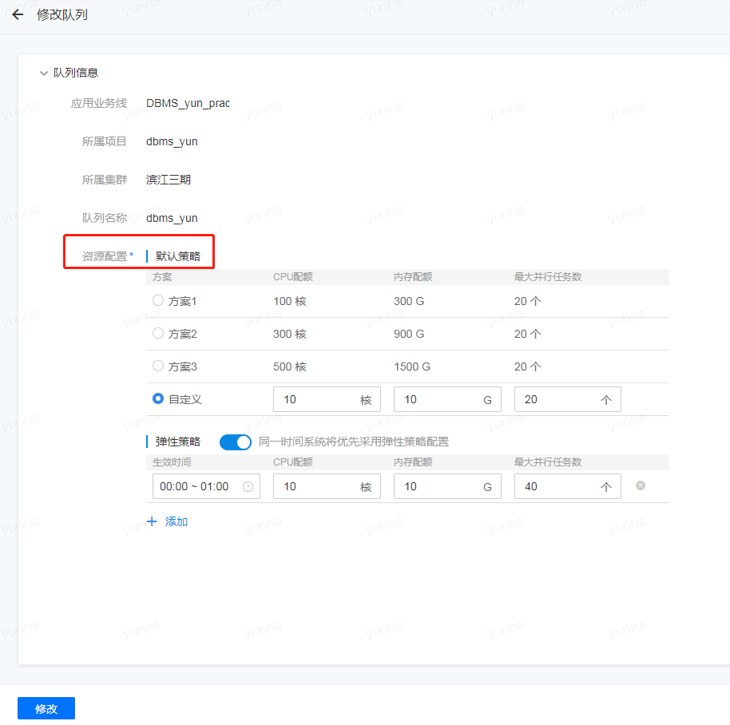
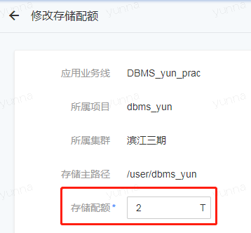
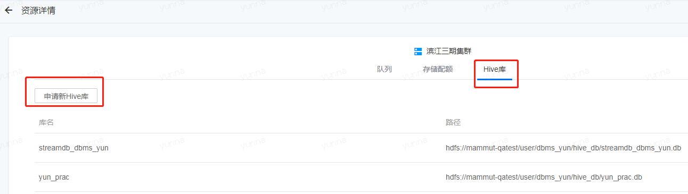

## 修改队列和存储配额

* 在“申请新队列”的左边是“查看详情”选项，选择“查看详情”。

 

* 中间三个Tab标签，分别是“队列”，“存储配额”和“Hive库”，可分别对其进行操作。 

* 在“队列”的Tab下，同样可以“申请新队列”，也可以对已申请的队列的资源配置进行修改。

队列资源的修改需要平台管理的审批，审批过后，可在“资源管理”中查看更改。

* 在“存储配额”的Tab下，可以对存储配额进行修改，同样需要管理员的审批通过。

* 在“Hive库”的Tab下，无法对已申请的Hive库修改，但可以进行“申请新Hive库”的操作。

完成上述操作之后，您已经拥有了可操作的项目空间，并且学会了如何申请新的资源；若您是管理员，也知道了如何邀请别人加入到当前的项目空间中，可以继续进行下面的学习了。
