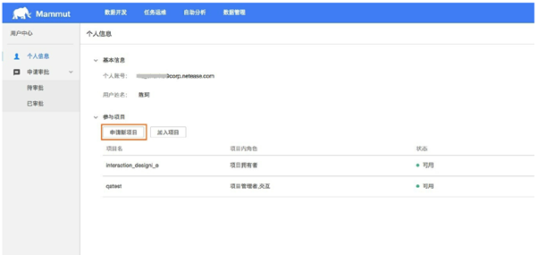
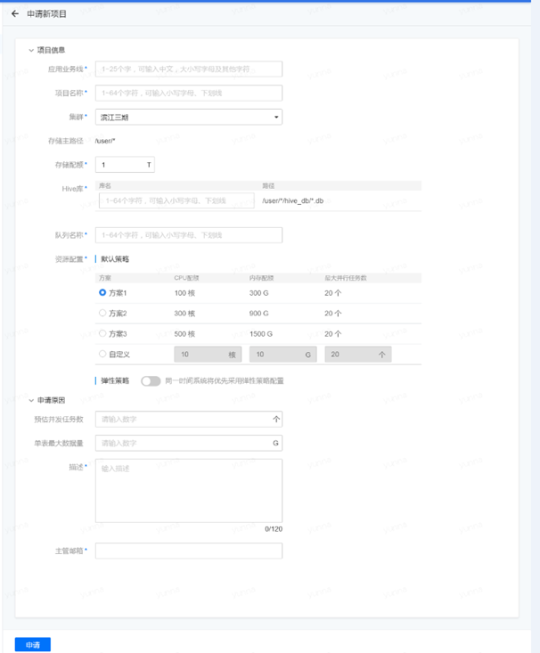
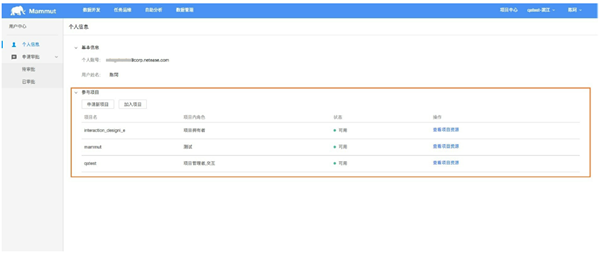

# 快速入门

在阅读本指南之前，请确保您拥有了项目空间，可通过下面的步骤拥有项目空间：

## 被邀请加入项目

其他项目空间的管理者邀请您加入项目，并赋予了相应的权限，更多关于权限的问题，请参考“模块指南”的“权限管理”部分。

## 申请自己的项目空间

* 登陆猛犸平台，鼠标放置在右上角您的用户名处，出现悬浮框，选择“用户中心”，进入“个人信息”页面，可以看到有“申请新项目”和“加入项目”两个选项，选择“申请新项目”。

 

* 填写项目的有关信息以及申请的原因。 

* 上述信息填写之后，点击“申请”，新项目需要平台管理员的审批，在申请审批的“待审批”页面中可以看到审批的进度。 

* 管理员审批之后，在“个人信息”中可以查看自己新申请的项目。

注：

您一旦成为了项目空间的owner，意味着该项目内您拥有最高的权限，在没有给别的用户赋予权限之前，任何人都没有权利访问您自己的项目空间。

