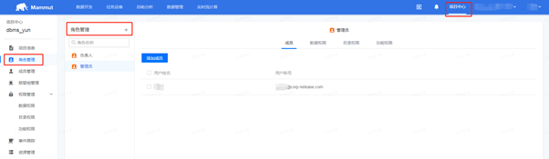
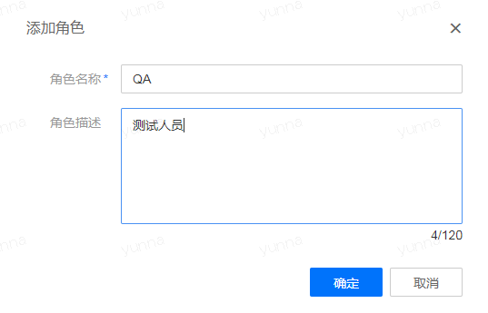
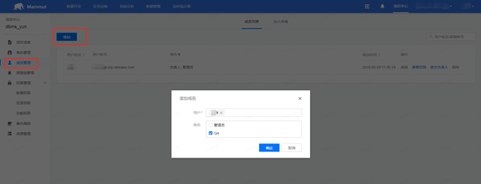
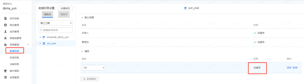
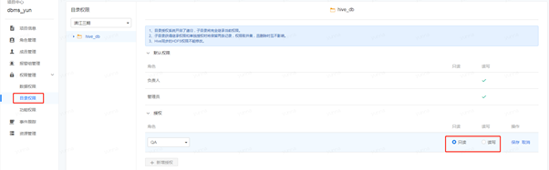
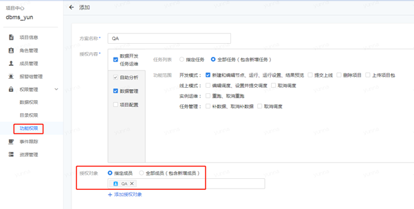

## 作为管理员，邀请用户，授予权限

如果您作为项目的管理者，计划邀请其他用户使用您创建的项目空间，可继续学习如何为其赋予相应的权限。

* 首先创建匹配被邀请人的角色信息。点击顶部菜单栏的“项目中心”，左侧菜单栏中选择“角色管理”，左上角的“角色管理+”用来创建新的项目角色。

* 填写对应的角色信息，“确定”之后，可以在“角色管理”界面看到新增的角色信息。

* 左侧菜单栏中选择“成员管理”，单击左上角的“添加”，填写被邀请人的账号信息，并赋予其对应的项目角色。

* 选择左侧菜单栏中的“权限管理”，对新增的项目角色赋予对应的权限。

针对“数据权限”，赋予角色某数据库中创建表的权限：

针对“目录权限”，授予角色某目录只读或者读写的权限：

针对“功能权限”，默认有“方案一”和“方案二”，可自己添加针对特定角色的权限信息。
点击“添加”，填写授权的信息，指定授权的对象。

